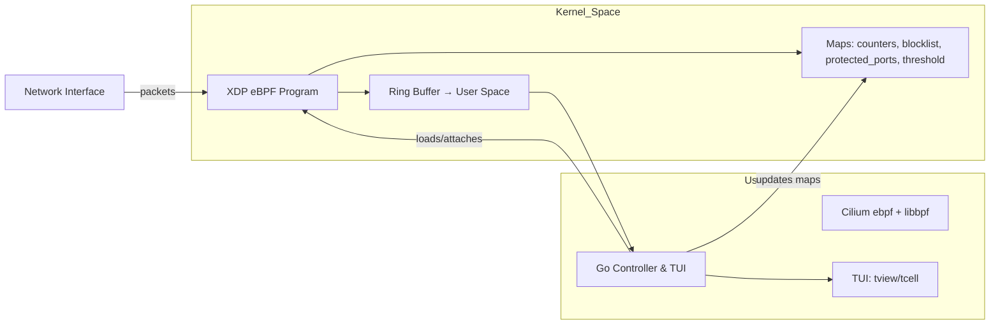
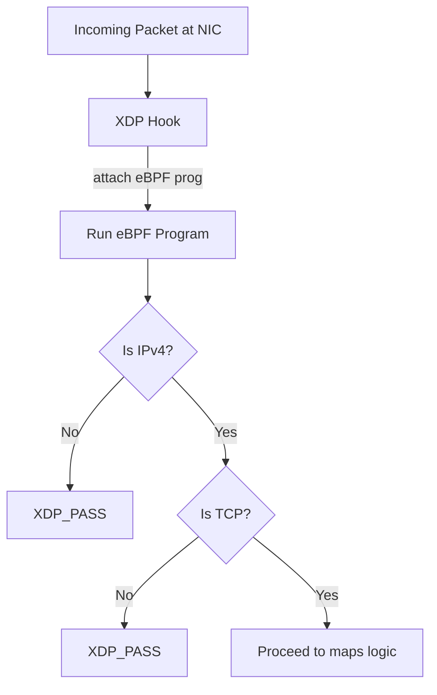
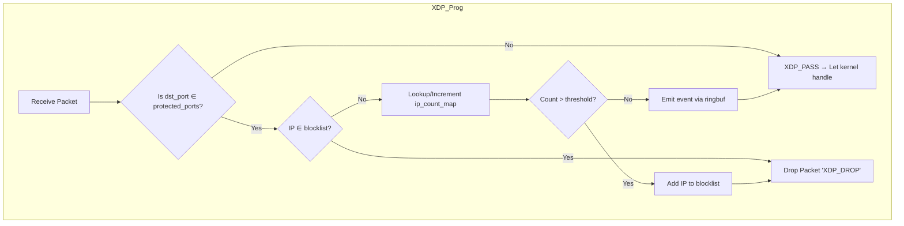
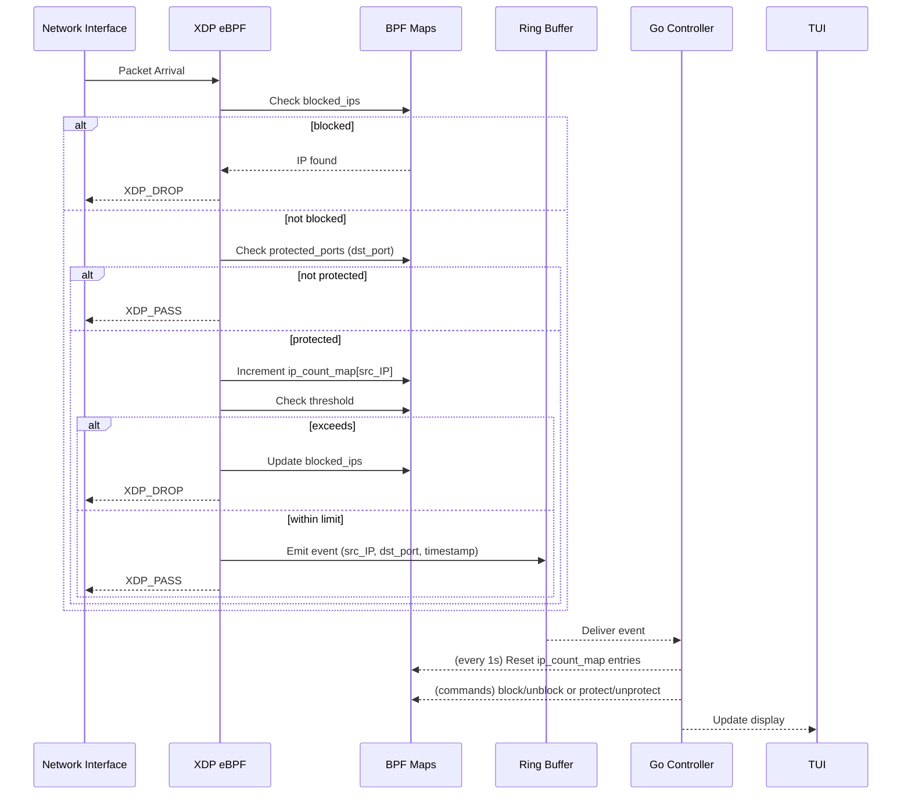
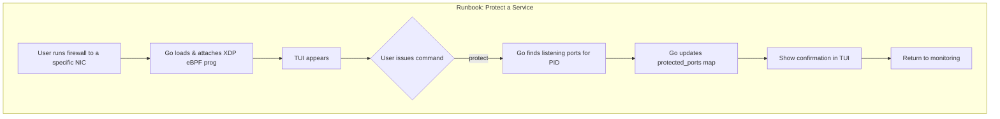

# l4shieldx

> A lean, mean **in-kernel eBPF/XDP TCP Firewall** for simple DoS prevention.  Logs per-second packet counts, auto-blocks offenders, and ships a TUI for real-time control.

## Introduction
This project demonstrates how to harness Linux’s eBPF/XDP stack to drop bad actors at line rate. It isn’t production-grade, but it works(!), it's (technically) fast, and it simply shows how modern firewalls (Cloudflare, Facebook) run in the kernel.


## Technology Stack
- **Kernel side**: C / libbpf + eBPF CO-RE, XDP hook  
- **User space**: Go / Cilium ebpf + tview/tcell for Terminal UI  
- **Maps & ringbuf**: per-IP counters, IP blocklist, protected-ports, threshold & events ring buffer  

## Architecture
1. **XDP eBPF program**  
   - Attach at the NIC driver level  
   - If `dst_port ∉ protected`, return `XDP_PASS`  
   - Else increment per-IP counter; if > threshold, add to blocklist + `XDP_DROP`, else emit event + `XDP_PASS`  
2. **Go controller & TUI**  
   - Loads & attaches the BPF object  
   - Reads the ring buffer for packet events  
   - Flushes & resets counters every second  
   - Offers commands to block/unblock IPs or protect/unprotect PIDs

## Quick Start
```sh
# 1. Build & install
make
sudo ./l4shieldx -i eth0

# 2. In the TUI:
protect 1234        # protect PID 1234’s listening ports
unprotect 1234      # remove that protection
deny 203.0.113.5    # manual block
allow 203.0.113.5   # manual unblock
setThreshold 50     # change pkts/sec limit
showProtected       # list current protections
exit                # quit and detach XDP (or hit Ctrl+C)
```

## Explanation by diagrams

1. **Project Architecture**: Kernel (XDP eBPF, maps, ring buffer) vs. User Space (Go controller, Cilium ebpf, TUI)


2. **XDP Packet Path**: How XDP hooks incoming packets, verifies IPv4/TCP, and proceeds


3. **Firewall Logic Flowchart**: Step-by-step packet filtering (protected ports, blocklist, rate‐limit)


4. **Sequence Diagram**: Detailed interaction from NIC to XDP to maps to user-space ring buffer and UI updates


5. **Runbook Flow**: How a user protecting a process leads to map updates and TUI confirmation

